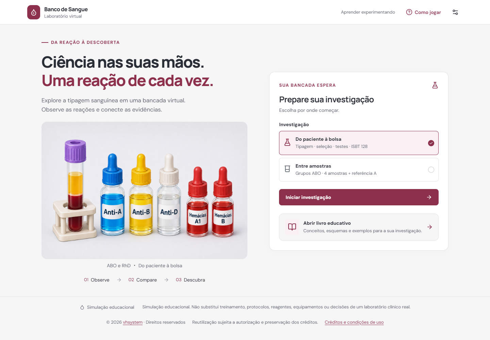
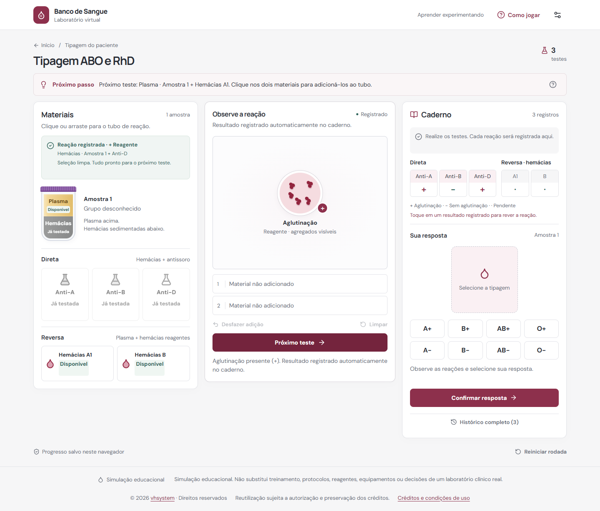
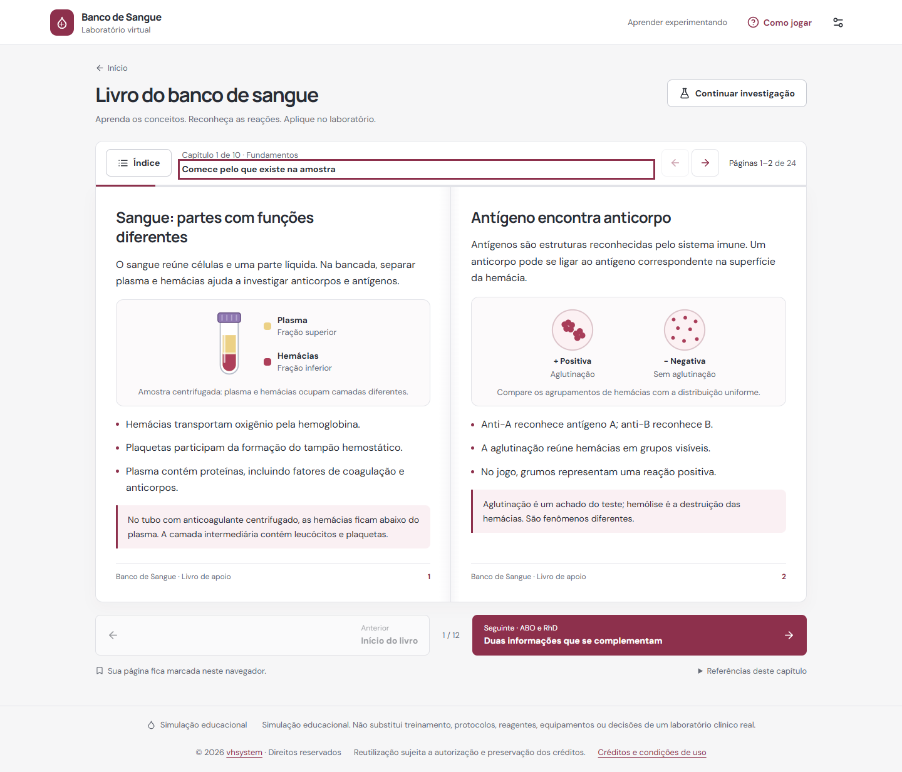

# Desafio do Banco de Sangue

**Um laboratório virtual para aprender imuno-hematologia pela investigação.**

O jogador observa reações, interpreta a tipagem sanguínea e acompanha um percurso didático até a seleção e verificação de hemocomponentes.

[**Abrir demonstração**](https://desafio-banco-de-sangue.vercel.app/)

## O que você pode explorar

- Tipagem ABO e RhD, com provas direta e reversa.
- Reagentes e amostras selecionáveis por clique ou arraste.
- Reações registradas automaticamente no caderno de laboratório.
- Cruzamentos entre amostras e interpretação dos resultados.
- Seleção progressiva de hemácias, plasma, crioprecipitado e plaquetas.
- Prova de compatibilidade, triagem e painel didático de anticorpos.
- Seleção E− e K− após identificação de anti-E, anti-K ou ambos, conforme o protocolo preventivo do exercício.
- Exploração de um rótulo educativo inspirado no ISBT 128.
- Livro de apoio com esquemas, exemplos e referências.

## Uma experiência feita para aprender

A interface mantém o paciente e os materiais em destaque, distingue cada hemocomponente e apresenta orientações breves durante as etapas. Não há pontuação nem penalização por tempo: o foco é observar, interpretar e compreender.

As mensagens ocupam espaços estáveis para evitar saltos na tela. O jogo se adapta ao computador e ao celular, oferece redução de animações e salva o progresso localmente no navegador. Após o carregamento inicial, os recursos preparados ficam disponíveis offline.

## Tecnologias

React · TypeScript · Vite · CSS · SVG · Lucide · Service Worker · Playwright

## Sobre este repositório

Esta é a **vitrine pública** do projeto. Ela contém apenas apresentação, imagens e informações para conhecer a proposta. A implementação e o histórico de desenvolvimento ficam em um repositório privado separado. A demonstração é publicada no Vercel.

O acesso à demonstração não concede autorização para redistribuir ou criar versões derivadas dos conteúdos próprios protegidos. Componentes de terceiros mantêm suas respectivas licenças.

## Escopo educativo

Simulação educacional. Não substitui treinamento, protocolos, equipamentos ou decisões de um laboratório clínico real. As regras simplificadas e o protocolo preventivo do exercício são apresentados com seus limites dentro da aplicação.

## Autoria

Desenvolvido por [vhsystem](https://github.com/vhsystem). © 2026. Direitos reservados sobre as contribuições próprias protegíveis.
